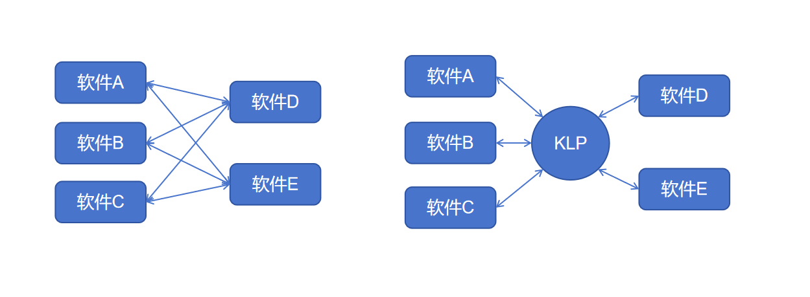
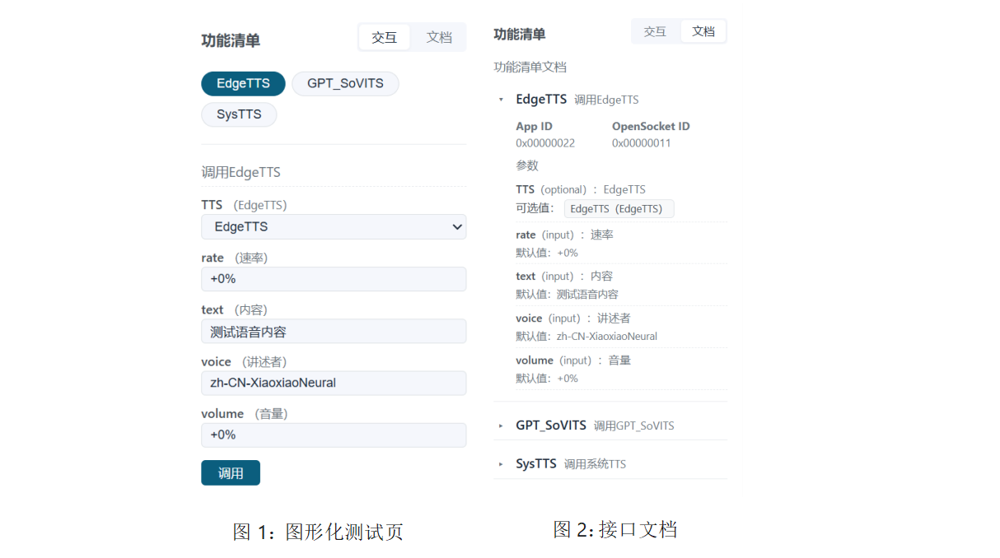
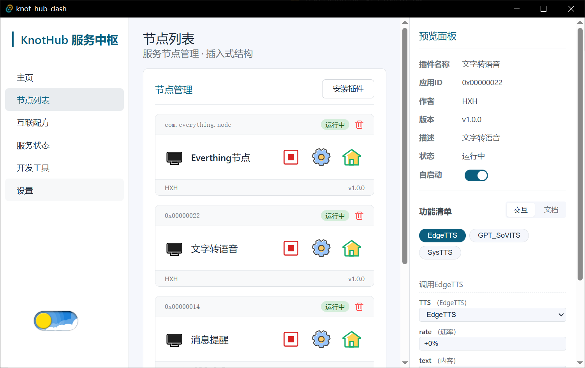
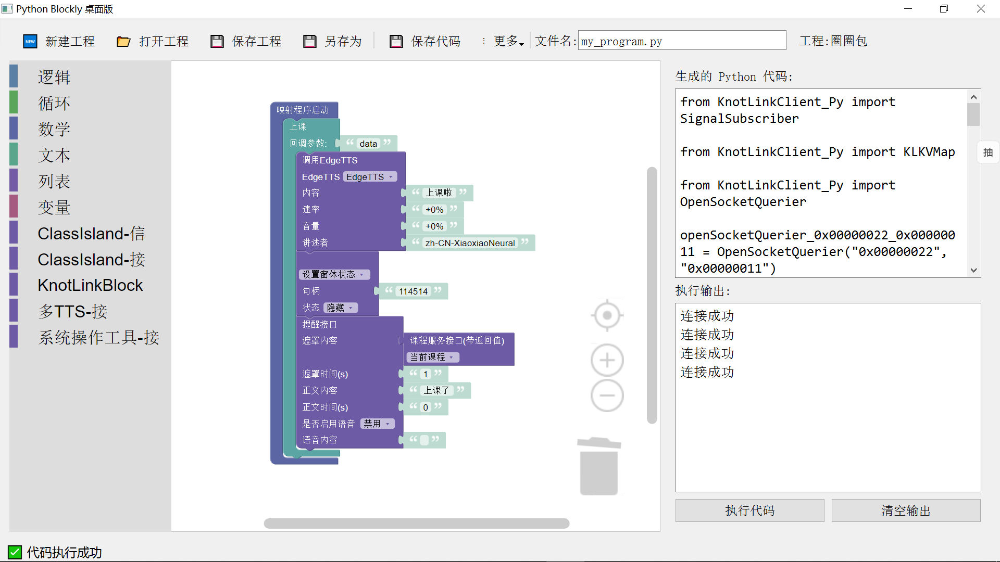
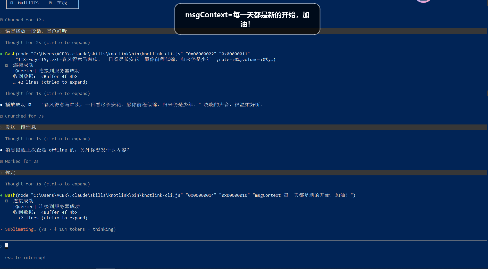

# KnotLink —— 为所有软件的对话，打一个理解的结

**软件互联的通用协议 · 轻量 · 开放 · 语义化**

---

## 我们发现了什么问题

你编写了一个软件，功能不错。别人想用，你得写文档、讲接口、陪对方联调。对方改需求，你改接口，所有调用方跟着改。

有两个软件，想让他们联动。得写适配代码，硬编码地址，处理不同格式。再多一个软件，适配代码翻倍。

**问题本质**

软件越来越多，互联成本越来越高。不是技术问题，是组织问题——谁维护对接？谁同步变更？谁保证文档不过期？

**现有方案**

自己写 URL API？可以，但每新增一个调用方，你多维护一份关系。

用 MCP？AI 能调了，但局域网内软件互相发现还是弱。

用 D-Bus？Linux 绑定，跨平台麻烦，配置复杂。

## KnotLink 的解决

KLP 基础库包装 TCP，处理“发布-订阅”与“询问-回复”链接，处理数据格式与传输。你只需关心功能实现，不关心网络细节。
[KLP基础库解读](https://www.kimi.com/chat/quickstart.md)

一份 JSON （FuncList）描述你的功能，放在软件根目录。KnotHub Core 扫描发现，其他软件按标准格式调用。
[功能清单规范](https://www.kimi.com/chat/quickstart.md)

以前，多一个调用，多一份维护；现在，一份功能清单+KLP工具链，瞬间解锁以下功能 ↓

基于 FuncList，KLP 工具链自动生成：

| 工具         | 产出                        | 给谁用             |
| :----------- | :-------------------------- | :----------------- |
| 图形化测试页 | 直接调试接口                | 开发者自测         |
| 接口文档     | 标准格式，无需手写          | 其他开发者接入     |
| 多语言 SDK   | Python / Cpp / Rust 调用库 | 其他应用集成       |
| 图形化代码块 | 拖拽填入参数                | 普通用户无代码调用 |
| MCP 桥接     | AI 助理直接理解调用         | AI 场景            |

KnotHub 管理节点，图形化拖拽生成配方，多个软件按编排自动联动。

AI Agent也可以无缝调用

KnotLink，让互联成本从 O(n²) 降到 O(n)

你的软件接入一次，被任意组合。用户自己配，不用你改代码。你回到写功能，不当接线员。

## 下一步

[安装 KnotHub，10 分钟跑通第一个节点](https://www.kimi.com/chat/quickstart.md)

## 加入生态

KnotLink 是一个开源项目，欢迎所有开发者参与共建：

* **为你的软件接入 KnotLink** — 让你的作品融入KnotLink生态
* **创建并分享互联配方** — 帮助更多人实现自动化
* **贡献代码或文档** — 一起完善这个协议

**让软件不再孤岛，让连接自然发生。**

## 有关链接

* GitHub：`github.com/KnotLink-Protocol`
* 文档：`knotlink.cn`

*KnotLink —— 软件互联，本该如此简单。*
